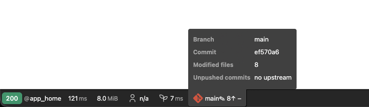
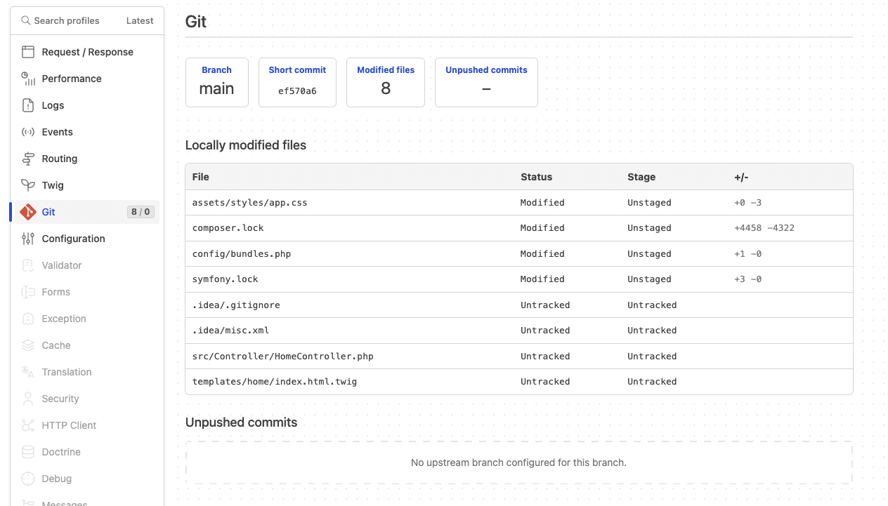

# GitProfilerBundle

[](https://packagist.org/packages/julienbohy/git-profiler-bundle)
[](https://packagist.org/packages/julienbohy/git-profiler-bundle)
[](https://github.com/julienbohy/git-profiler-bundle/actions/workflows/ci.yml)
[](LICENSE)


Symfony bundle that exposes the Git state of the current repository — **branch**, **short commit**,
**modified files** and **unpushed commits** — in a dedicated **Web Profiler** panel.

## Features

- Current **branch** and **short commit** of `HEAD`, in the profiler toolbar and panel.
- Live toolbar counters for **locally modified files** (✎) and **unpushed commits** (↑).
- Detailed **working-tree changes** — staged, unstaged and untracked — with their status
  (added, modified, deleted, renamed…).
- **Commits ahead of the upstream** (unpushed) with hash, message, author, date and the files they touch.
- **Zero configuration** — active as soon as the Web Profiler is, in `dev`/`test` only.
- **Graceful degradation** — no exception when the directory is not a Git repository or `git` is unavailable.

## Screenshots

The compact **toolbar** segment — branch and counters at a glance:



The full **profiler panel** — working-tree changes and unpushed commits in detail:



## Requirements

- PHP **8.3+**
- Symfony **6.4**, **7.x** or **8.x**
- The `git` binary available in the runtime environment
- Git reading relies on [`gitonomy/gitlib`](https://github.com/gitonomy/gitlib)

## Installation

```bash
composer require --dev julienbohy/git-profiler-bundle
```

### Registering the bundle

The bundle is not shipped with a Symfony Flex recipe, so register it manually in `config/bundles.php`:

```php
return [
    // ...
    JulienBohy\GitProfilerBundle\GitProfilerBundle::class => ['dev' => true, 'test' => true],
];
```

The bundle is only useful in a development environment (Web Profiler): `dev` (and `test`) are enough.

## Usage

No configuration required. As soon as the profiler is active, a **Git** panel appears in the debug
bar and in the profiler.

In the (compact) **toolbar** you get the current **branch** followed by **two counters**: the number
of **locally modified files** (✎) and the number of **unpushed commits** (↑).

The **detailed panel** additionally shows:

- the **short commit** of `HEAD`;
- the **list of uncommitted working-tree files** (staged, unstaged, untracked) with their status
  (added, modified, deleted, renamed…);
- the **list of local commits ahead of the remote** (unpushed) — short hash, message, author, date —
  **together with the list of files they touch**.

Unpushed-commit detection:

- it is based on the **upstream** branch (`@{u}`, e.g. `origin/main`); with no upstream configured,
  the section says so and the counters show `–`;
- the list of unpushed files is the **net diff** `@{u}..HEAD` (a file created then deleted within the
  range therefore does not appear).

If the directory is not a Git repository (or if `git` is unavailable), the panel states it cleanly —
no exception is thrown.

## Tests

```bash
composer install
vendor/bin/phpunit
```

## License

MIT © 2026 Julien Bohy
